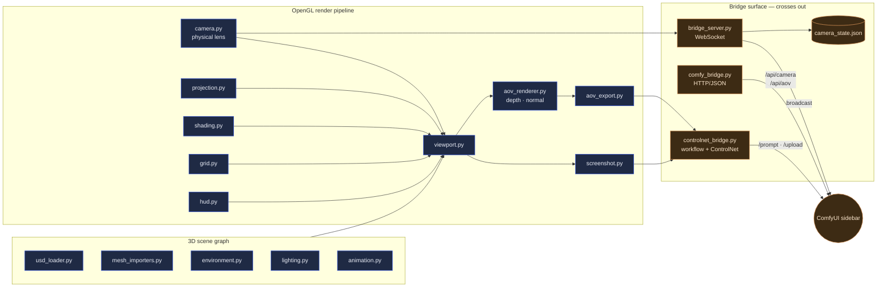
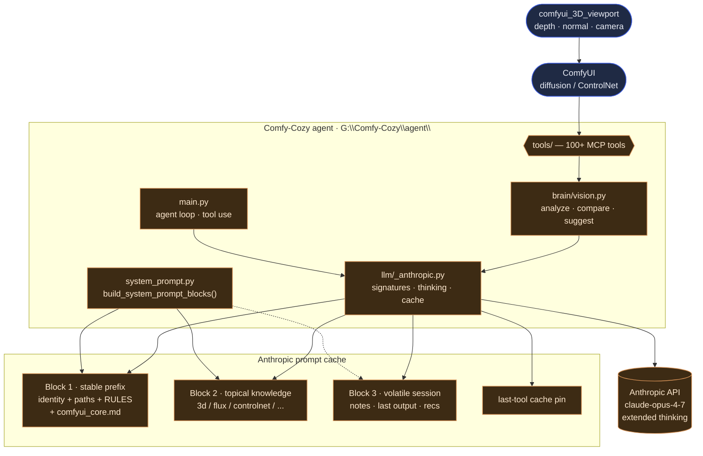

# comfyui_3D_viewport

A native OpenGL 3D viewport for ComfyUI workflows — physical-camera–accurate,
non-blocking, and able to stream depth + normal AOVs, screenshots, and camera
state into ComfyUI's ControlNet / 3D pipelines.

This repo is the **data producer**. The thinking happens next door in
[`Comfy-Cozy`](https://github.com/JosephOIbrahim/Comfy-Cozy), the Opus 4.7
co-pilot that consumes the AOVs and camera state when artists ask for changes.

---

## Architecture

**Tone key for both diagrams.** Deep **navy** = the local, deterministic
world (geometry, math, framebuffers, the things the viewport literally is).
Warm **amber** = anything that crosses outward — the bridge surface, ComfyUI,
the LLM brain. Same two tones used everywhere so you can scan a diagram
and read "this side vs. that side" at a glance.

### Diagram 1 — Viewport internals & bridge surface (this repo)



Navy is everything that stays in-process (scene graph, GL render pipeline).
Amber is everything that leaves — the WebSocket / HTTP / ControlNet bridges
and the ComfyUI sidebar they talk to. The viewport never calls an LLM itself.

### Diagram 2 — Where the AOVs land: the Comfy-Cozy / Opus 4.7 brain



Navy is the deterministic data side — the viewport, ComfyUI, the artifacts.
Amber is the Opus 4.7 brain: the agent loop, the prompt-cache blocks (two of
them ephemeral-cached, the third deliberately volatile), the last-tool cache
pin, and the API itself. Three of Anthropic's four cache breakpoints stay
hot across a session, so the 100+ tool schema and the knowledge prefix ride
the cache for free after the first turn.

---

## Recent changes (May 2026)

The viewport surface itself is stable; the meaningful upgrade was on the
brain side. Summary of what's new across the pair:

| Layer | Change |
|---|---|
| Model defaults | `AGENT_MODEL` flipped to `claude-opus-4-7`; new `FAST_MODEL` (`claude-haiku-4-5`) and `VISION_MODEL` tiers, all env-overridable. |
| Extended thinking | Wired through `provider.stream()` / `provider.create()` with a per-call `thinking_budget`. Default budget on the agent loop: 4000 tokens; vision: 2000 tokens. |
| Signature handling | `ThinkingBlock.signature` captured from API and replayed in multi-turn messages — required for safe extended thinking + tool use. |
| Prompt caching | System prompt split into three blocks (stable prefix · topical knowledge · volatile tail) so two long-lived cache breakpoints survive across turns. The last-tool breakpoint is unchanged, so the 100+ tool schema also caches. |
| Vision pipeline | The static `analyze_image` / `compare_outputs` / `suggest_improvements` system prompts now ship under a cache block; previously zero caching on vision. |
| Multi-provider safety | `system: str | list[dict]` and `thinking_budget` propagated through OpenAI / Gemini / Ollama providers (flattened where not supported) so the call site is provider-agnostic. |
| Docs | Parent path corrected from the stale `C:\Users\User\comfyui-agent\` to `G:\Comfy-Cozy\agent\`; architecture quick-reference rewritten to match the real layout. |

---

## Get it running

**Goal.** A 3D viewport window on your desktop, talking to ComfyUI.
**Time.** ~5 minutes if Python 3.10+ is already installed, ~10 if not.

If you'd rather skip the walk-through, the 60-second version:

```bash
git clone https://github.com/JosephOIbrahim/comfyui-3D-viewport
cd comfyui-3D-viewport
python -m venv .venv && .venv\Scripts\activate
pip install -r requirements.txt
python -m src.viewport
```

A window opens. You're in.

### The walk-through (four miles)

Each step has a time tag and a **You should see** check. If a step takes
more than 2× the time tag, the **If stuck** note below it covers the
common gotcha. You can stop and pick up between miles — your virtual
environment remembers where you were.

---

#### Mile 1 of 4 · Get Python  ·  ⏱ 5 min (skip if you have 3.10–3.12)

Grab the installer from [python.org/downloads](https://www.python.org/downloads/).
On the **first** installer screen, tick the box that says
**"Add python.exe to PATH"** before clicking Install. That single
checkbox prevents most install pain people hit later.

**You should see:** open a new terminal, type `python --version`, and a
version `3.10.x`–`3.12.x` prints back.

> **If stuck:** if typing `python` opens the Microsoft Store, you missed
> the PATH checkbox. Uninstall from "Add or Remove Programs", re-run the
> installer, tick the box.

---

#### Mile 2 of 4 · Grab the code  ·  ⏱ 30 sec

```bash
git clone https://github.com/JosephOIbrahim/comfyui-3D-viewport
cd comfyui-3D-viewport
```

**You should see:** a `comfyui-3D-viewport` folder with `src/`, `tests/`,
`docs/`, and a `requirements.txt` inside.

> **If stuck:** no `git` installed? Click the green **Code** button on
> the GitHub page and pick **Download ZIP**. Unzip, then `cd` into the
> folder.

---

#### Mile 3 of 4 · Install the libraries  ·  ⏱ 2–3 min

```bash
python -m venv .venv
.venv\Scripts\activate
pip install -r requirements.txt
```

The first line builds a **virtual environment** — a sandbox so this
project's libraries can't fight with anything else on your machine.
The second line steps into the sandbox: once it's active, your terminal
prompt grows a `(.venv)` on the left. That's the visual cue you're
inside.

**You should see:** a stream of "Successfully installed ..." lines,
then a clean prompt. Total download is ~150 MB (PySide6 is the bulk).

> **If stuck — slow pip?** Normal. PySide6 is large. Five minutes is fine.
>
> **If stuck — usd-core error?** You're on Python 3.13+. Drop to 3.12
> and re-run from Mile 1.
>
> **If stuck — wrong terminal?** On PowerShell, `.venv\Scripts\activate`
> works. On Git Bash, use `source .venv/Scripts/activate`. On macOS/Linux,
> `source .venv/bin/activate`.

---

#### Mile 4 of 4 · Open the viewport  ·  ⏱ 10 sec

```bash
python -m src.viewport
```

**You should see:** a window with a grid floor, a default light rig, and
an empty 3D space. Drag a `.glb`, `.obj`, `.ply`, or `.usd` file onto the
window — it loads.

> **If stuck — black window, no grid?** Your GPU driver is older than
> the GL version this needs. Update it.
>
> **If stuck — text microscopic on a 4K monitor?** Set
> `set QT_SCALE_FACTOR=1.5` before launching, or `1.75` for higher DPI.

You're in. From here:

- Drag-and-drop a mesh and orbit the camera (left-drag) to find your shot.
- Hit the AOV button to write a depth + normal pass to disk.
- For ComfyUI integration and the bridge protocol, read
  [`docs/architecture_decision.md`](docs/architecture_decision.md) and
  [`docs/integration_contract.md`](docs/integration_contract.md).

### Run the tests (optional, ~30 sec)

```bash
pytest tests/
```

187 tests across 16 modules, fully mocked, no ComfyUI required. Useful when
something breaks and you want to know whether it's the code or your machine.

---

## File map

```
src/
  viewport.py          OpenGL window + render loop
  camera.py            Physical-camera math (sensor · focal length · DOF)
  projection.py        World → screen projection
  shading.py           Materials and shader programs
  lighting.py          Multi-light rig
  environment.py       HDRI / sky
  grid.py · hud.py     Reference visuals
  animation.py         Timeline + keyframes
  selection.py         Object picking
  outliner.py          Scene tree UI
  gizmo.py             Transform handles
  undo.py              Undo stack
  usd_loader.py        USD scene import
  mesh_importers.py    GLB / OBJ / PLY
  texture_manager.py   GPU texture lifecycle
  aov_renderer.py      Depth + normal pass renderer
  aov_export.py        AOV serialization
  screenshot.py        Frame capture + batching
  bridge_server.py     Async WebSocket server (Qt event loop)
  comfy_bridge.py      HTTP/JSON to ComfyUI /api/camera, /api/aov
  controlnet_bridge.py Build & queue ControlNet workflows
  config.py            Constants + paths
  math_utils.py        Shared math helpers
  stage_builder.py     Scene initialization
  file_drop.py         Drag-and-drop handler
```

---

## Related projects

- [Comfy-Cozy](https://github.com/JosephOIbrahim/Comfy-Cozy) — the Opus 4.7
  co-pilot that consumes this viewport's AOVs / camera state and steers
  ComfyUI on the artist's behalf.
