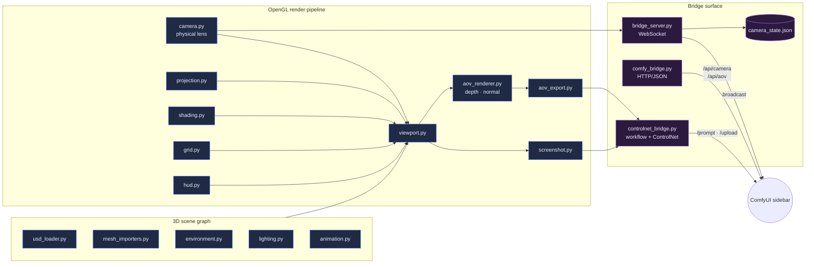

# comfyui_3D_viewport

A native OpenGL 3D viewport for ComfyUI workflows — physical-camera–accurate,
non-blocking, and able to stream depth + normal AOVs, screenshots, and camera
state into ComfyUI's ControlNet / 3D pipelines.

This repo is the **data producer**. The thinking happens next door in
[`Comfy-Cozy`](https://github.com/JosephOIbrahim/Comfy-Cozy), the Opus 4.7
co-pilot that consumes the AOVs and camera state when artists ask for changes.

---

## Architecture

### Diagram 1 — Viewport internals & bridge surface (this repo)



**Tone key.** Slate/blue = the viewport's local OpenGL world (math, scene
graph, framebuffers). Violet = the bridge surface — everything that crosses
the process boundary to ComfyUI. The viewport never calls an LLM itself.

### Diagram 2 — Where the AOVs land: the Comfy-Cozy / Opus 4.7 brain


**Tone key.** Slate/blue = the systems the viewport touches directly
(ComfyUI, the viewport itself). Amber = the Opus 4.7 brain. Block 1 and
Block 2 are cached ephemeral; Block 3 is the volatile session tail and is
deliberately uncached. The last tool definition pins a third cache
breakpoint so the 100+ MCP tool schema rides the cache too.

---

## Recent changes (May 2026)

The viewport surface itself is stable; the meaningful upgrade was on the
brain side. Summary of what's new across the pair:

| Layer | Change |
|---|---|
| Model defaults | `AGENT_MODEL` flipped to `claude-opus-4-7`; new `FAST_MODEL` (`claude-haiku-4-5`) and `VISION_MODEL` tiers, all env-overridable. |
| Extended thinking | Wired through `provider.stream()` / `provider.create()` with a per-call `thinking_budget`. Default budget on the agent loop: 4000 tokens; vision: 2000 tokens. |
| Signature handling | `ThinkingBlock.signature` captured from API and replayed in multi-turn messages — required for safe extended thinking + tool use. |
| Prompt caching | System prompt split into three blocks (stable prefix · topical knowledge · volatile tail) so two long-lived cache breakpoints survive across turns. The last-tool breakpoint is unchanged, so the 100+ tool schema also caches. |
| Vision pipeline | The static `analyze_image` / `compare_outputs` / `suggest_improvements` system prompts now ship under a cache block; previously zero caching on vision. |
| Multi-provider safety | `system: str | list[dict]` and `thinking_budget` propagated through OpenAI / Gemini / Ollama providers (flattened where not supported) so the call site is provider-agnostic. |
| Docs | Parent path corrected from the stale `C:\Users\User\comfyui-agent\` to `G:\Comfy-Cozy\agent\`; architecture quick-reference rewritten to match the real layout. |

---

## Quickstart

```bash
python -m venv .venv
.venv\Scripts\activate           # PowerShell / cmd
pip install -r requirements.txt
pytest tests/                    # ~16 modules, fully mocked, no ComfyUI needed
```

Launching the viewport, ComfyUI integration, and the bridge protocol live in
`docs/architecture_decision.md` and `docs/integration_contract.md`.

---

## File map

```
src/
  viewport.py          OpenGL window + render loop
  camera.py            Physical-camera math (sensor · focal length · DOF)
  projection.py        World → screen projection
  shading.py           Materials and shader programs
  lighting.py          Multi-light rig
  environment.py       HDRI / sky
  grid.py · hud.py     Reference visuals
  animation.py         Timeline + keyframes
  selection.py         Object picking
  outliner.py          Scene tree UI
  gizmo.py             Transform handles
  undo.py              Undo stack
  usd_loader.py        USD scene import
  mesh_importers.py    GLB / OBJ / PLY
  texture_manager.py   GPU texture lifecycle
  aov_renderer.py      Depth + normal pass renderer
  aov_export.py        AOV serialization
  screenshot.py        Frame capture + batching
  bridge_server.py     Async WebSocket server (Qt event loop)
  comfy_bridge.py      HTTP/JSON to ComfyUI /api/camera, /api/aov
  controlnet_bridge.py Build & queue ControlNet workflows
  config.py            Constants + paths
  math_utils.py        Shared math helpers
  stage_builder.py     Scene initialization
  file_drop.py         Drag-and-drop handler
```

---

## Related projects

- [Comfy-Cozy](https://github.com/JosephOIbrahim/Comfy-Cozy) — the Opus 4.7
  co-pilot that consumes this viewport's AOVs / camera state and steers
  ComfyUI on the artist's behalf.
